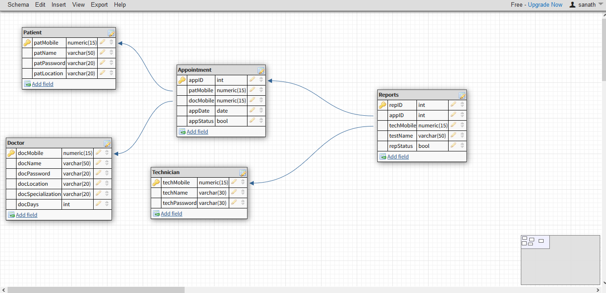

# Hospital Registry
A simple Hospital Registry website built using Java Servlet and JSP technologies.

<h4>Database Schema</h4>

<h4>SETUP</h4>
<ol>
  <li><b>Create Database</b> by running the "Database/Database setup.sql" MySql file </li>
  <li>Update <b>Database Username and Password</b> in "src/com/hospital/registry/DATABASE_PARAMETERS.java"</li>
  <li><b>Update the WAR</b> file by running <b>"mvn package"</b> in your terminal. The war file can be found in "Deploy/HospitalRegitry.war"</li>
  <li>Host the file on a apache tomcat server and you are all set to go!</li>
</ol>
